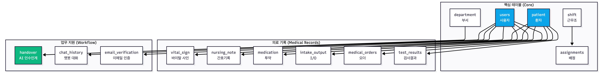

# MediFlow EMR - 개발자 가이드

> 간호사의 실무 경험을 기반으로 설계된 차세대 전자의무기록 시스템 개발 환경 설정 및 개발 가이드

##  중요 주의사항

### 보안
- `.env` 파일은 **절대 Git에 커밋하지 마세요**
- API 키, DB 비밀번호 등 민감 정보는 `.env.example`에 실제 값을 넣지 마세요
- GitHub에 업로드하기 전 `.gitignore`에 `.env`가 포함되어 있는지 확인하세요

### 데이터
- 이 프로젝트는 **포트폴리오 목적**으로, 모든 환자 데이터는 **가상**입니다
- 실제 병원 환자 정보를 절대 입력하지 마세요
- 개인정보보호법 위반 위험이 있습니다

### 배포
- 프로덕션 환경에서는 `application-prod.yml` 사용
- AWS 배포 시 `.env` 파일이 아닌 **EC2 환경 변수** 또는 **AWS Secrets Manager** 사용 권장

---

## 목차

- [개발 환경 설정](#개발-환경-설정)
- [프로젝트 구조](#프로젝트-구조)
- [로컬 실행 방법](#로컬-실행-방법)
- [테스트 계정](#테스트-계정)
- [환경 변수 설정](#환경-변수-설정)
- [API 문서](#api-문서)
- [데이터베이스](#데이터베이스)
- [개발 가이드](#개발-가이드)
- [성능 최적화 팁](#성능-최적화-팁)
- [CI/CD 파이프라인](#cicd-파이프라인)
- [트러블슈팅](#트러블슈팅)

---

## 개발 환경 설정

### 필수 요구사항

| 항목 | 버전 | 설치 확인 |
|------|------|-----------|
| Java | 21 | `java -version` |
| Node.js | 18+ | `node -v` |
| MariaDB | 10.x | `mysql --version` |
| Gradle | 8.x | `gradle -v` |

---

## 프로젝트 구조
```
mediflow-emr/
├── backend/                    # Spring Boot 백엔드
│   ├── src/
│   │   ├── main/
│   │   │   ├── java/com/mediflow/emr/
│   │   │   │   ├── config/           # 설정 (Security, JWT, OAuth2)
│   │   │   │   ├── controller/       # REST API 컨트롤러
│   │   │   │   ├── service/          # 비즈니스 로직
│   │   │   │   ├── repository/       # JPA Repository
│   │   │   │   ├── entity/           # JPA 엔티티
│   │   │   │   ├── dto/              # 데이터 전송 객체
│   │   │   │   ├── exception/        # 예외 처리
│   │   │   │   ├── init/             # 초기 데이터 생성 (DataInitializer.java)
│   │   │   │   └── util/             # 유틸리티 (JWT, Cookie)
│   │   │   └── resources/
│   │   │       ├── application.yml           # 공통 설정
│   │   │       ├── application-dev.yml       # 개발 환경
│   │   │       └── application-prod.yml      # 운영 환경
│   │   └── test/              # 테스트 코드
│   ├── .env                   # 환경 변수 (Git 제외, .gitignore에 명시)
│   ├── .env.example           # 환경 변수 템플릿
│   ├── .gitignore             # Git 제외 파일 목록
│   ├── build.gradle           # Gradle 빌드 설정
│   └── gradlew                # Gradle Wrapper
│
├── frontend/                  # React + Vite 프론트엔드
│   ├── src/
│   │   ├── components/        # React 컴포넌트
│   │   │   ├── auth/          # 인증 관련
│   │   │   ├── common/        # 공통 컴포넌트
│   │   │   ├── dashboard/     # 대시보드
│   │   │   ├── patient/       # 환자 관리
│   │   │   └── handover/      # 인수인계
│   │   ├── pages/             # 페이지 컴포넌트
│   │   ├── services/          # API 클라이언트
│   │   ├── stores/            # Zustand 상태 관리
│   │   ├── routes.jsx         # 라우팅 설정
│   │   └── main.jsx           # 엔트리 포인트
│   ├── .env                   # 환경 변수 (Git 제외, .gitignore에 명시)
│   ├── .env.example           # 환경 변수 템플릿
│   ├── .gitignore             # Git 제외 파일 목록
│   ├── package.json           # npm 의존성
│   └── vite.config.js         # Vite 설정
│
├── docs/                      # 프로젝트 문서
│   ├── PROJECT_OVERVIEW.md
│   ├── ARCHITECTURE.md
│   ├── DATABASE_DESIGN.md
│   └── ...
│
└── swagger.yaml               # OpenAPI 3.0 문서
```

---

## 로컬 실행 방법

### 1. 저장소 클론
```bash
git clone https://github.com/MediFlow-EMR/mediflow-dev.git
cd mediflow-dev
```

### 2. 데이터베이스 설정
```bash
# MariaDB 설치 (macOS)
brew install mariadb
brew services start mariadb

# 데이터베이스 생성
mysql -u root -p
```
```sql
CREATE DATABASE mediflowdb CHARACTER SET utf8mb4 COLLATE utf8mb4_unicode_ci;
CREATE USER 'mediflow'@'localhost' IDENTIFIED BY 'your_password';
GRANT ALL PRIVILEGES ON mediflowdb.* TO 'mediflow'@'localhost';
FLUSH PRIVILEGES;
EXIT;
```

### 3. 백엔드 실행
```bash
cd backend

# .env 파일 생성 (템플릿 복사)
cp .env.example .env

# .env 파일 수정 (에디터로 열어서 실제 값 입력)
vim .env

# Gradle 빌드 및 실행
./gradlew bootRun

```

**실행 확인:**
```bash
curl http://localhost:9005/actuator/health
# 응답: {"status":"UP"}
```

### 4. 프론트엔드 실행
```bash
cd frontend

# 의존성 설치
npm install

# .env 파일 생성
cp .env.example .env

# 개발 서버 실행 (http://localhost:3000)
npm run dev
```

**실행 확인:**
- 브라우저에서 `http://localhost:3000` 접속

---

## 테스트 계정

### 로컬 개발 시 사용 가능한 더미 계정

개발 환경(`application-dev.yml`)에서 자동으로 생성되는 테스트 계정입니다.

**간호사 계정 (응급실):**
```
이메일: nurseer1@mediflow.com
비밀번호: nurse123@
```

**간호사 계정 (중환자실):**
```
이메일: nurseicu1@mediflow.com
비밀번호: nurse123@
```

**간호사 계정 (내과병동):**
```
이메일: nursemw1@mediflow.com
비밀번호: nurse123@
```
---

### 환경 변수 생성 방법

#### JWT Secret 생성
```bash
# 256비트 랜덤 키 생성 후 Base64 인코딩
openssl rand -base64 32
```

#### Google OAuth2 설정

1. [Google Cloud Console](https://console.cloud.google.com/) 접속
2. 프로젝트 생성 → API 및 서비스 → OAuth 2.0 클라이언트 ID 생성
3. 승인된 리디렉션 URI: `http://localhost:9005/login/oauth2/code/google`

#### Kakao OAuth2 설정

1. [Kakao Developers](https://developers.kakao.com/) 접속
2. 애플리케이션 추가 → 플랫폼 설정 → Web 플랫폼 등록
3. Redirect URI: `http://localhost:9005/login/oauth2/code/kakao`

#### Naver 이메일 

**이메일 인증 기능 사용 시에만 필요합니다.**

1. [Naver](https://naver.com) 로그인 → 내정보 → 보안설정
2. 2단계 인증 활성화
3. 애플리케이션 비밀번호 생성
4. 생성된 비밀번호를 `MAIL_PASSWORD`에 입력

#### 식약처 API

1. [공공데이터포털](https://www.data.go.kr/) 접속
2. "의약품 정보" 검색 → 활용신청
3. 승인 후 서비스 키 발급

#### Gemini AI

1. [Google AI Studio](https://makersuite.google.com/app/apikey) 접속
2. API 키 생성

---

## API 문서

### Swagger UI

**로컬 환경:**
```
http://localhost:9005/swagger-ui.html
```

**Swagger Editor (온라인):**
1. [https://editor.swagger.io](https://editor.swagger.io) 접속
2. `swagger.yaml` 파일 내용 붙여넣기

**상세 API 문서:** [docs/API_DOCUMENTATION.md](https://github.com/MediFlow-EMR/MediFlow-docs/blob/main/6.API_DOCUMENTATION.md)

---

## 데이터베이스

### ERD 


**상세 ERD:** [docs/DATABASE_DESIGN.md](https://github.com/MediFlow-EMR/MediFlow-docs/blob/main/5.DATABASE_DESIGN.md)

---

### 초기 데이터

개발 환경에서는 `DataInitializer.java`가 자동으로 샘플 데이터를 생성합니다:

**생성되는 데이터:**
- 부서: 응급실, 중환자실, 내과병동, 외과병동, 내과외래, 외과외래, 수술실, 투석실 (8개)
- 근무조: 주간/초번/야간 (오늘 날짜 기준)
- 사용자: Admin 1명 + 간호사 33명
- 환자: 가상 더미 데이터 (실제 환자 정보 아님)
    - 응급실: 15명
    - 중환자실: 12명
    - 내과병동: 35명
    - 외과병동: 30명
    - 내과외래: 20명
    - 외과외래: 18명
    - 수술실: 6명
    - 투석실: 10명
- 바이탈 사인, 간호기록, 투약 기록, 섭취배설량, 의료 오더, 검사 결과, 인수인계 등

**초기화 비활성화:**
```yaml
# application-dev.yml
spring:
  jpa:
    hibernate:
      ddl-auto: validate  # create → validate로 변경
```

**초기화 재실행:**
```bash
# 데이터베이스 초기화 후 재시작
mysql -u mediflow -p mediflowdb -e "DROP DATABASE mediflowdb; CREATE DATABASE mediflowdb CHARACTER SET utf8mb4 COLLATE utf8mb4_unicode_ci;"
./gradlew bootRun
```

---

### 데이터베이스 마이그레이션

**현재 전략:** JPA DDL Auto (개발 환경)

**권장 전략:** Flyway 도입
```gradle
// build.gradle
implementation 'org.flywaydb:flyway-core'
implementation 'org.flywaydb:flyway-mysql'
```
```
src/main/resources/db/migration/
├── V1__init_schema.sql
├── V2__add_indexes.sql
└── V3__add_fulltext_search.sql
```

---

### 새 API 추가 방법

**1. Entity 생성**
```java
@Entity
@Table(name = "new_table")
public class NewEntity extends BaseTimeEntity {
    @Id
    @GeneratedValue(strategy = GenerationType.IDENTITY)
    private Long id;
    // ...
}
```

**2. Repository 생성**
```java
public interface NewRepository extends JpaRepository<NewEntity, Long> {
    List<NewEntity> findByPatientId(Long patientId);
}
```

**3. DTO 생성**
```java
public record NewRequest(
    @NotNull Long patientId,
    @NotBlank String content
) {}
```

**4. Service 생성**
```java
@Service
@RequiredArgsConstructor
public class NewService {
    private final NewRepository repository;
    
    public NewResponse create(NewRequest request) {
        // 비즈니스 로직
    }
}
```

**5. Controller 생성**
```java
@RestController
@RequestMapping("/api/new")
@RequiredArgsConstructor
public class NewController {
    private final NewService service;
    
    @PostMapping
    public ApiResponse<NewResponse> create(@Valid @RequestBody NewRequest request) {
        return ApiResponse.ok(service.create(request));
    }
}
```

**6. Swagger 문서 업데이트**
```yaml
# swagger.yaml에 엔드포인트 추가
```
---

## 트러블슈팅

### 백엔드

**문제: Port 9005 already in use**
```bash
# 포트 사용 중인 프로세스 확인
lsof -i :9005

# 프로세스 종료
kill -9 <PID>
```

---

**문제: JWT 토큰 검증 실패**
```bash
# JWT_SECRET이 256비트 이상인지 확인
echo -n "your-secret" | wc -c  # 32자 이상이어야 함

# 새 Secret 생성
openssl rand -base64 32
```

---

**문제: OAuth2 리다이렉트 오류**
```yaml
# application-dev.yml에서 redirect-uri 확인
redirect-uri: 'http://localhost:9005/login/oauth2/code/google'
# Google Console의 승인된 리디렉션 URI와 정확히 일치해야 함
```

---

**문제: 데이터베이스 연결 실패**
```bash
# MariaDB 실행 확인
brew services list | grep mariadb

# MariaDB 재시작
brew services restart mariadb

# 연결 테스트
mysql -h localhost -P 3306 -u mediflow -p mediflowdb
```

---

**문제: 초기 데이터가 생성되지 않음**
```yaml
# application-dev.yml 확인
spring:
  jpa:
    hibernate:
      ddl-auto: create  # validate가 아닌 create여야 함
```

---

### 프론트엔드

**문제: CORS 에러**
```javascript
// vite.config.js 확인
server: {
  proxy: {
    '/api': {
      target: 'http://localhost:9005',
      changeOrigin: true,
    },
  },
}
```

---

**문제: 쿠키가 전송되지 않음**
```javascript
// apiClient.js 확인
axios.defaults.withCredentials = true;
```
```yaml
# Backend application-dev.yml 확인
spring:
  security:
    cors:
      allowed-origins: http://localhost:3000
      allow-credentials: true
```

---

**문제: 빌드 실패**
```bash
# node_modules 삭제 후 재설치
rm -rf node_modules package-lock.json
npm install

# 캐시 삭제
npm cache clean --force
```

---

**문제: Vite 개발 서버가 느림**
```javascript
// vite.config.js에 최적화 설정 추가
export default defineConfig({
  optimizeDeps: {
    include: ['react', 'react-dom', 'axios'],
  },
});
```

---

### 공통

**문제: 환경 변수 로드 안 됨**
```bash
# .env 파일 위치 확인
ls -la backend/.env
ls -la frontend/.env

# .env 파일 권한 확인
chmod 600 backend/.env
chmod 600 frontend/.env

# 환경 변수 확인 (Backend)
cd backend
./gradlew bootRun --debug

# 환경 변수 확인 (Frontend)
cd frontend
npm run dev -- --debug
```

---

**문제: Git에 .env 파일이 커밋됨**
```bash
# .gitignore에 .env가 있는지 확인
cat .gitignore | grep .env

# 이미 커밋된 .env 파일 제거
git rm --cached backend/.env
git rm --cached frontend/.env
git commit -m "chore: Remove .env files from Git"

# 강제로 히스토리에서 제거 (주의: 위험한 작업)
git filter-branch --force --index-filter \
  "git rm --cached --ignore-unmatch backend/.env frontend/.env" \
  --prune-empty --tag-name-filter cat -- --all
```

---

## 추가 문서

- **[프로젝트 개요](https://github.com/MediFlow-EMR/MediFlow-docs/blob/main/1.PROJECT_OVERVIEW.md)** - 전체 시스템 소개
- **[기능명세서](https://github.com/MediFlow-EMR/MediFlow-docs/blob/main/3.FEATURES.md)** - 기능명세서
- **[아키텍처](https://github.com/MediFlow-EMR/MediFlow-docs/blob/main/4.ARCHITECTURE.md)** - AWS 3-Tier 구조
- **[법적 고려사항](https://github.com/MediFlow-EMR/MediFlow-docs/blob/main/8.LEGAL_COMPLIANCE.md)** - 의료법/개인정보보호법

---
